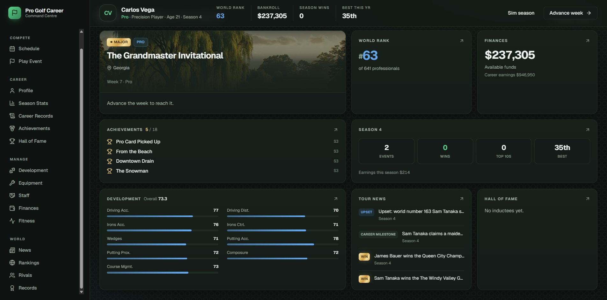
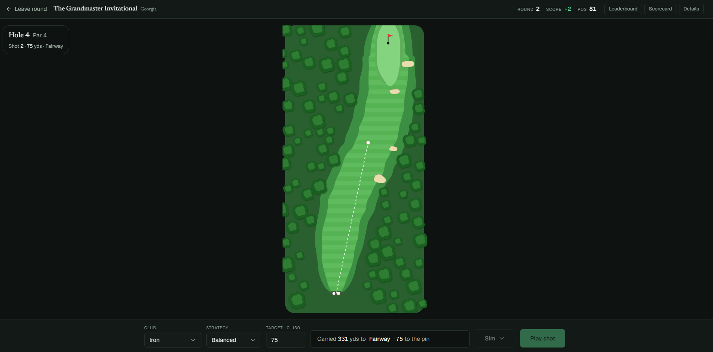
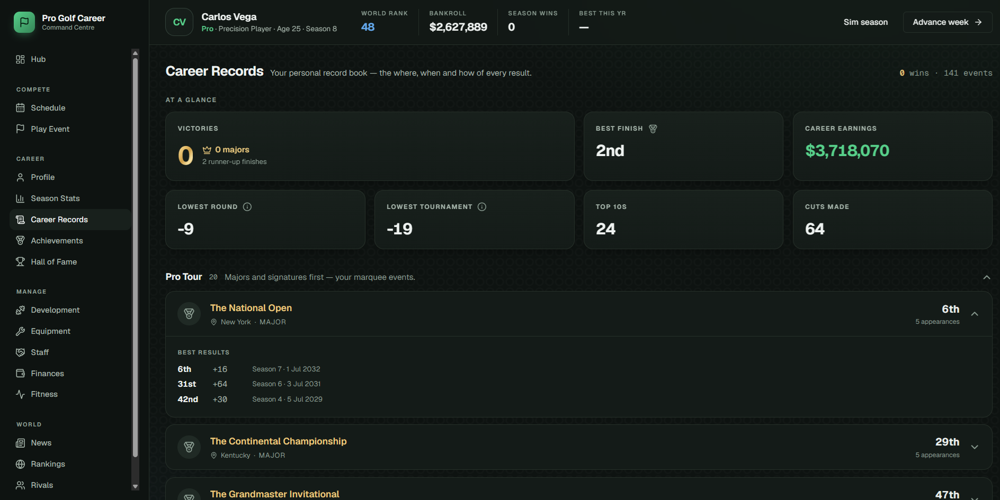

# Pro Golf Career

Pro Golf Career is a single-player professional-golf career simulation. Create a golfer, make tactical decisions during tournaments, and manage the long-term choices around training, scheduling, staff, equipment, sponsorships, and finances.

The game has no swing meter or reflex-based input: performance is resolved by the simulation from player attributes, conditions, decisions, and controlled variance.

## Screenshots

### Career command centre

The career hub brings together the next event, world ranking, finances, player development, season progress, and tour news.



### Shot-by-shot event play

During an event, the player chooses how to approach each shot while following hole, round, and leaderboard context.



### Career records

Completed events feed into a persistent career history with results, round scores, and performance statistics.



## What you do

- Create a professional golfer and develop their attributes over multiple seasons.
- Schedule events, play tournaments shot by shot or simulate them, and compete against a simulated tour field.
- Make off-course decisions about fitness, staff, equipment, sponsorships, and finances.
- Follow rankings, achievements, rivals, records, and season/career results; save and resume a career.

## Technical approach

- **Frontend:** Next.js 16 App Router, React 19, TypeScript, Tailwind CSS, TanStack Query, and GraphQL Code Generator.
- **Backend:** Java 21 and Spring Boot 3 with a schema-first GraphQL API, Spring Security, and JWT authentication.
- **Browser/API boundary:** Next.js route handlers act as a backend-for-frontend layer. The browser talks to the BFF, which calls the Spring GraphQL API server-side and maintains the session in httpOnly cookies.
- **Simulation boundary:** `com.progolf.sim.*` contains the framework-free game engine. Spring, GraphQL resolvers, authentication, and persistence live in `com.progolf.app.*`; an architecture test guards that separation.
- **Persistence:** there is currently no database. User accounts and career saves are stored as JSON files, and a full world session is snapshotted and restored through the save-game store.

The GraphQL schema is checked in at [`backend/src/main/resources/graphql/schema.graphqls`](backend/src/main/resources/graphql/schema.graphqls). Frontend operation types are generated from that schema before frontend development, type-checking, and production builds.

## Run locally

### Prerequisites

Install Docker with Docker Compose available.

### Start the application

````md
1. Create a local environment file from the example:

   ```bash
   cp .env.example .env
   # Windows PowerShell:
   Copy-Item .env.example .env
   # Windows Command Prompt:
   copy .env.example .env
   ```

2. In `.env`, replace the placeholder `PROGOLF_JWT_SECRET` with a unique local value of at least 32 characters. The backend and Docker Compose require this value; `.env` is ignored by Git.

3. Build and start both services:

   ```bash
   docker compose up --build
   ```

Open the frontend at [http://localhost:3000](http://localhost:3000). The backend is available at [http://localhost:8080](http://localhost:8080), with GraphiQL at [http://localhost:8080/graphiql](http://localhost:8080/graphiql).

Docker Compose stores local users and saves in its `backend-data` volume. When running the backend outside Docker, its default local directories are `backend/users/` and `backend/saves/`; both can be overridden with `PROGOLF_USERS_DIR` and `PROGOLF_SAVES_DIR`.

## Verification commands

For backend work, install JDK 21 and Maven:

```bash
cd backend
mvn test       # JUnit suite, including the simulation/application boundary test
mvn package     # Build the runnable Spring Boot jar
```

For frontend work, install Node.js and pnpm:

```bash
cd frontend
pnpm install
pnpm lint
pnpm typecheck
pnpm build
pnpm format:check
```

The frontend does not currently have a separate unit-test runner; its available checks are linting, TypeScript validation, build, and formatting. `pnpm typecheck` and `pnpm build` run GraphQL code generation first.

## Repository layout

| Path | Purpose |
| --- | --- |
| [`frontend/`](frontend) | Next.js player interface and BFF route handlers |
| [`backend/`](backend) | Spring Boot application, GraphQL API, authentication, persistence, and simulation engine |
| [`docs/`](docs) | Product, technical, and frontend design documentation |
| [`img-assets/`](img-assets) | Source scenery artwork used by course and event views |

## Further reading

- [Product vision and requirements](docs/backend/explore.md)
- [Player experience and game decision surfaces](docs/backend/player-experience.md)
- [Technology stack notes](docs/backend/tech_stack.md)
- [Frontend design documentation](docs/frontend/)
